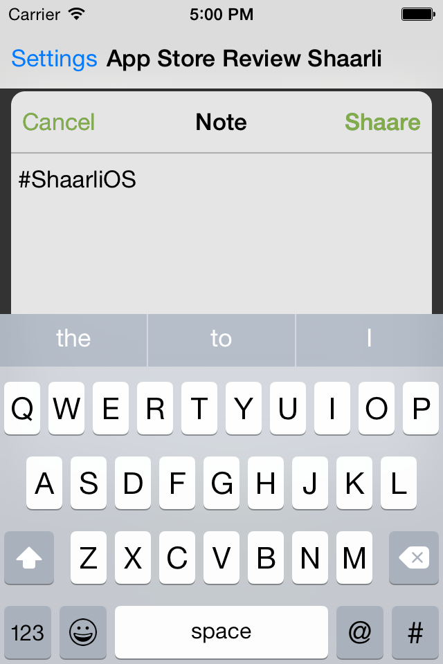
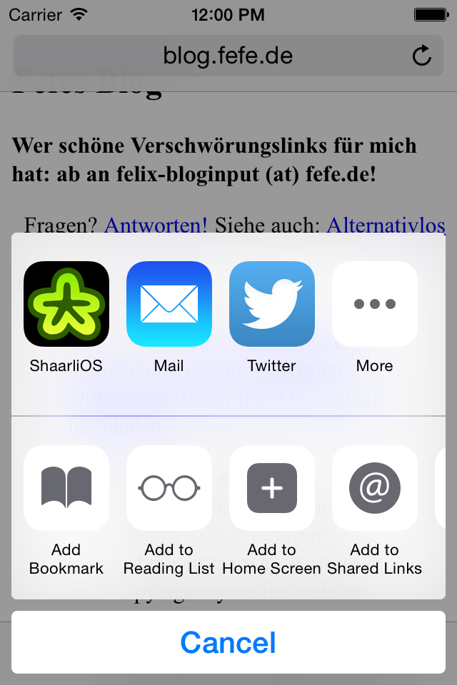
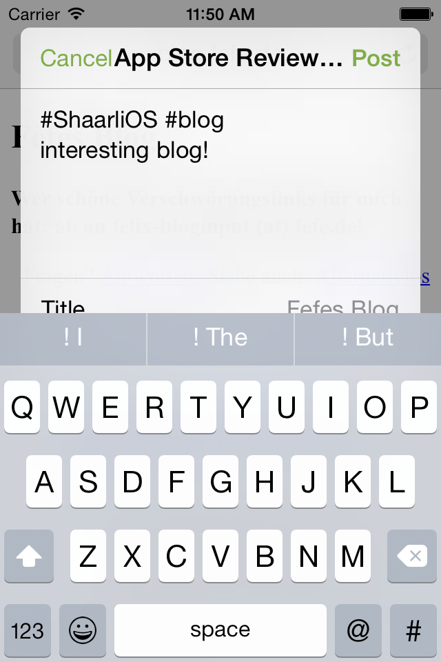
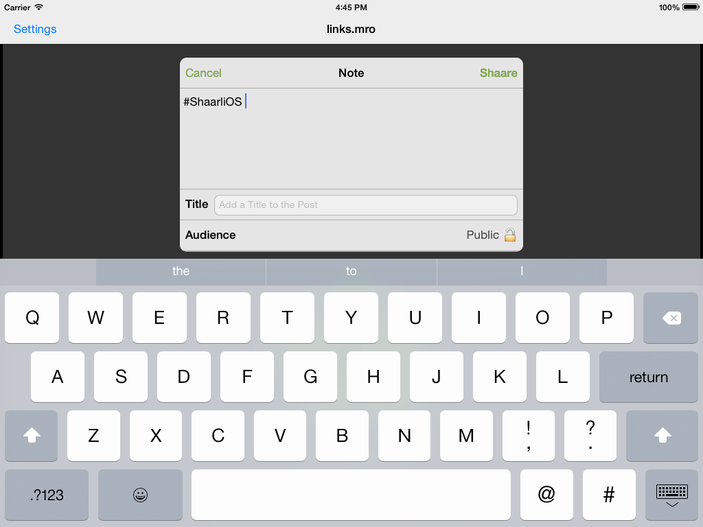

# The missing iOS 8+ share extension to [Shaarli](http://sebsauvage.net/wiki/doku.php?id=php:shaarli)

Share links with ease from every iOS app.

## Screenshots

## License

- `shaarli-*.svg` by [idleman](http://blog.idleman.fr/), [zlib/libpng OSI licence](http://www.opensource.org/licenses/zlib-license.php),
- `ios/*.svg,ios/*.png` by [idleman](http://blog.idleman.fr/) and [mro](http://mro.name/me), [zlib/libpng OSI licence](http://www.opensource.org/licenses/zlib-license.php),
- `ios/ShaarliOS/infra/SOKeyValueObserver.?` by [Daniel Eggert](https://twitter.com/danielboedewadt), see [here](https://github.com/objcio/issue-7-lab-color-space-explorer/blob/9551c8b6f67dd46eca91d93c0437d10ff9ee4eed/Lab%20Color%20Space%20Explorer/KeyValueObserver.m),
- `ios/ThirdParty/onepassword-app-extension/` by [AgileBits, Inc.](https://github.com/AgileBits/onepassword-app-extension), [MIT License](http://opensource.org/licenses/MIT),
- `ios/ThirdParty/PDKeychainBindingsController/` by [Carl Brown of PDAgent, LLC](https://github.com/carlbrown/PDKeychainBindingsController), [MIT License](http://opensource.org/licenses/MIT),
- `appstore/Download_on_the_App_Store_Badge_US-UK_135x40.svg` by [Apple Inc.](http://apple.com), all rights reserved,
- *all others* by [mro](http://mro.name/me), [GPL v3](http://www.gnu.org/licenses/gpl-3.0.html)

## Credits

except the material used and listed above, I'm happy to thank

- [vanilla Shaarli](http://sebsauvage.net/wiki/doku.php?id=php:shaarli) by [sebsauvage](http://sebsauvage.net/),
- [community Shaarli](https://github.com/shaarli/Shaarli) by [the github shaarli contributors](https://github.com/shaarli/Shaarli/graphs/contributors),
- [Dimitri van Heesch's doxygen](http://www.stack.nl/~dimitri/doxygen/),
- [Ben Gardner's uncrustify](http://uncrustify.sourceforge.net/),
- all the [contributors to git](https://github.com/git/git/graphs/contributors),
- [Rowan James' GitX fork](http://rowanj.github.io/gitx/),
- [Inkscape communiy](https://inkscape.org/en/community/),
- [stackoverflow](http://stackoverflow.com/),
- [Apple Inc.](http://apple.com/).

## Design Goals

| Quality         | very good | good | normal | irrelevant |
|-----------------|:---------:|:----:|:------:|:----------:|
| Functionality   |           |  ×   |        |            |
| Reliability     |           |      |    ×   |            |
| Usability       |     ×     |      |        |            |
| Efficiency      |           |      |    ×   |            |
| Changeability   |           |  ×   |        |            |
| Portability     |           |      |        |      ×     |

 
